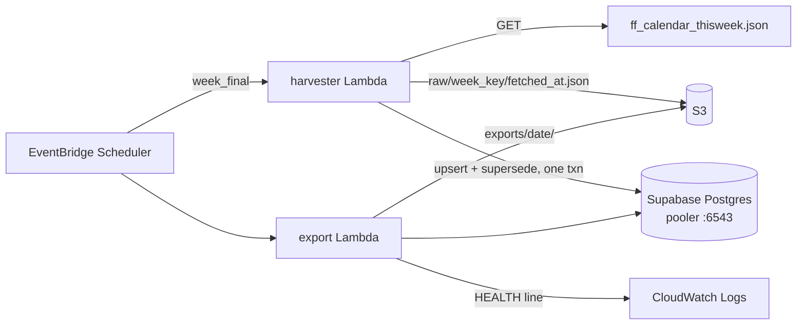

# Design Document

## Overview

Two Lambdas, no servers. The **harvester** fetches the ForexFactory weekly feed on a schedule, snapshots it to S3, and upserts it into Postgres. The **exporter** dumps live rows to dated flat files and logs one health line.

All correctness-critical logic lives in four pure modules that `pytest` exercises with no mocking; the two entrypoints do I/O and orchestration only. Anything the design gets wrong here fails *silently* — duplicated rows, a merged event, a wholesale-retired week — so the shape below exists to make each of those a testable unit rather than a property of a deployed system.

Notation carried over from `requirements.md`: `[DERIVED]` marks a decision made here and stated in no source document; `[OPEN]` marks an unresolved conflict.

## Architecture



One shared execution role, one shared layer (`psycopg[binary]`, `httpx`, `tzdata` — manylinux), one scheduler role extended per function. The database string comes from SSM `SecureString`.

AWS credentials resolve through the default `boto3` chain: the developer's profile locally, the execution role in Lambda. Same code, no branch. `boto3` is installed locally as a dev dependency and stays out of `requirements.txt` and the layer — the Lambda runtime ships it.

## Modules

`src/` is pure except `handler.py` and `export.py` — stdlib only, no `boto3`, no connection (G7).

| Module | Interface | Notes |
|---|---|---|
| `parse.py` | `parse(raw: str) -> Value` | `Value(num: Decimal\|None, unit, suffix, flag)`, frozen. `num` fully expanded; `suffix` provenance only. Never raises, never drops. |
| `week.py` | `ff_week_start(d: datetime) -> date` | Sunday-start, evaluated in `America/New_York`. The one implementation. |
| `identity.py` | `normalize_title(s) -> str`<br/>`event_key(country, normalized_title, week_key, event_timestamp) -> str` | sha1 hex over the four parts joined by `\|`. Convenience — the DB constraint is the authority. |
| `guard.py` | `already_satisfied(rows, slot, now) -> bool` | `now` is a **parameter**, not a clock read `[DERIVED]` — the 5-minute floor lives here and G7 forbids non-determinism. |
| `handler.py` | `lambda_handler(event, context)` | Orchestration only. `week_final` read from `event`. |
| `export.py` | `lambda_handler(event, context)` | Full dump + `HEALTH` line. |

`normalize_title` = unescape `\/` → trim → collapse internal whitespace → lowercase. Measured against 137 titles it is effectively the identity function; the unescape rule is the load-bearing part (37 occurrences in one payload).

## Data model

`migrations/001.sql`, hand-run once. Three tables, per spec §4:

- **`raw_snapshots`** — one row per successful fetch: `fetched_at, week_key, week_final, s3_key, byte_size, payload_sha256`.
- **`events`** — the product. `*_raw` (text, as published) alongside `*_num` (`numeric`) and `*_flag` for both forecast and previous; `superseded_at` (NULL = live); four `actual_*` columns reserved and always NULL.
- **`fetch_log`** — one row per *attempt*, including failures. The gap detector.

```sql
CONSTRAINT events_identity UNIQUE (country, normalized_title, week_key, event_timestamp)
CREATE INDEX ON events (event_timestamp);
CREATE INDEX ON events (country, event_timestamp);
CREATE INDEX ON events (week_key) WHERE superseded_at IS NULL;
```

Why these four parts, all measured: `country` because 17 titles collide across countries; `event_timestamp` at full precision because dropping it merges `FOMC Member Hammack Speaks` (twice in one week) and truncating it to the date merges the ADP `08:14`/`08:15` pair, which carry different `previous`. `source_suffix` is excluded — this feed emits none.

`week_key` is stored as its own column as well as being hashed into `event_key`, so week queries need no hash recomputation.

## Harvest flow

Fixed order — S3 precedes parse so a parser crash still leaves the payload recoverable:

```
guard → HTTP 200 → HTML check → json.loads → non-empty list →
required fields → currency filter → PUT raw to S3 → parse →
[ upsert → supersede ]  one transaction  → fetch_log
```

**Week key from contents.** `week_key = ff_week_start(min(row.date))` over the payload. Never the clock — a clock-derived key scoping the supersede `UPDATE` is the one available way to destroy a finished week (G4).

**Upsert** targets `ON CONFLICT ON CONSTRAINT events_identity`, compares with `IS DISTINCT FROM` (not `<>`, so NULLs compare correctly), and holds `superseded_at` inside the comparison tuple while resetting it to `NULL`. Without it in the tuple a returning event whose values are unchanged never revives — the failure is permanent and silent.

**Supersede** runs in the same transaction, scoped to that `week_key`, retiring live rows whose `event_key` is absent from the payload. Soft delete only; reads default to `WHERE superseded_at IS NULL`. Self-healing — a row wrongly retired by a truncated payload returns on the next slot, so the blast radius is one slot.

## Error handling

Every path ends in a `fetch_log` row. There is no in-process sleep-retry — the paired +10 min slot is the retry, and Lambda's own `MaximumRetryAttempts` is `0`.

| Condition | Outcome | Action |
|---|---|---|
| Guard satisfied | *(no row)* | Exit immediately, free |
| HTML body (rate limit) | `rate_limited` | Abort **before** `json.loads` |
| Non-200 / timeout / DNS | `network` | Log, exit |
| Bad JSON, missing fields | `parse_error` | Log, exit |
| `[]` | `empty` | Log, exit |
| Success | `ok` | Counts recorded |
| Value fails to parse | *(not an outcome)* | Warning; raw string stored regardless (G2) |
| Unknown `impact` | *(not an outcome)* | Log; row kept |

`httpx` at 10s connect / 20s read — a hung socket otherwise costs the whole slot.

## Scheduling

| Job | Cron (UTC) | Input |
|---|---|---|
| Harvest | `0 0,6,12,18 * * *` | — |
| Retry | `10 0,6,12,18 * * *` | — |
| Sweep | `0 11 * * 6` | `{"week_final": true}` |
| Sweep retry | `10 11 * * 6` `[DERIVED]` | `{"week_final": true}` |
| Export | `0 12 * * 0` `[DERIVED]` | — |

One function serves every schedule. Retries fire unconditionally and are configuration only — skip logic belongs in `guard.py`, never in a schedule.

**Rollover is Saturday 19:00 ET.** Anchor it to ET, not UTC — a UTC anchor drifts an hour in November. The Sat 11:00 UTC sweep clears it by ~12h in either season.

## Export and health

Full dump of live rows via `csv.DictWriter` / `json.dump` to a temp file, then upload to `exports/<date>/events.{csv,json}`. Dated because S3 versioning is off and a fixed key would destroy the previous dump.

The same function runs the `fetch_log` gap query and logs exactly one line — `HEALTH ok slots=28 gaps=0` or `HEALTH FAIL <reason>`, with a missing Saturday sweep reported explicitly rather than as a generic gap. Two CloudWatch alarms exist with **no actions attached**; SNS is wired when remembering to look becomes the failure mode.

## Testing strategy

Pure modules under plain `pytest`, no mocks, fixtures from `json-files/`. `week.py` and `identity.py` are tested harder than the parser: a bad parse logs a warning, a bad week or identity key duplicates rows in silence.

Prefer **measured** assertions over properties — a property test written alongside an implementation agrees with it; a measured number does not:

- `week.py` — a real payload collapses to one key, against the recorded `isocalendar()` split (`(2026,32)`×3 + `(2026,33)`×71 for week 08-09). Boundary rows `2026-08-09T19:50:00-04:00` and `2026-08-16T18:30:00-04:00`. The November `-05:00` fixture is **hand-built** — no captured payload exercises it.
- `identity.py` — the negative assertion (same `(country, date)` across payloads → same key), the 17 cross-country collisions, the two same-week repeats, and `"  German  Factory\/Orders m\/m  "` → one key.
- `guard.py` — each outcome value, empty rows, within-5-minutes at a fixed instant, and a row from a different slot.
- Integration, run locally before deploy — `this_WED.json` then `this_SAT.json` against a clean database yields **74 live, 5 superseded** (79 without supersession); re-harvesting `this_WED.json` revives all five; `this_SUN.json` leaves week 08-09 untouched.
